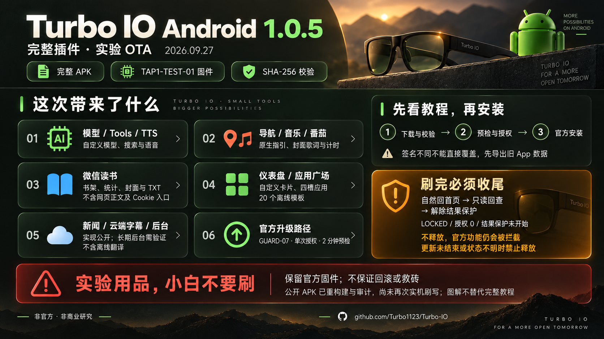
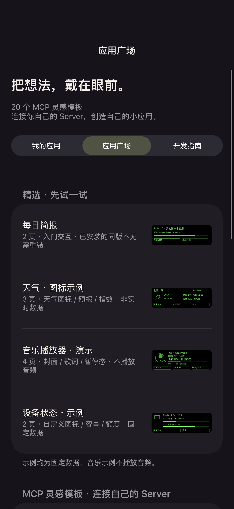
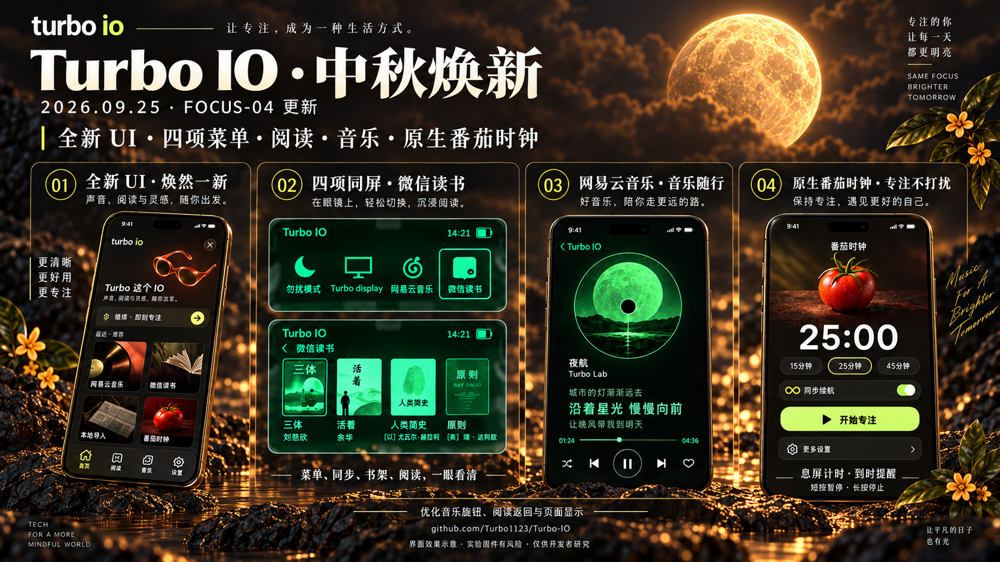
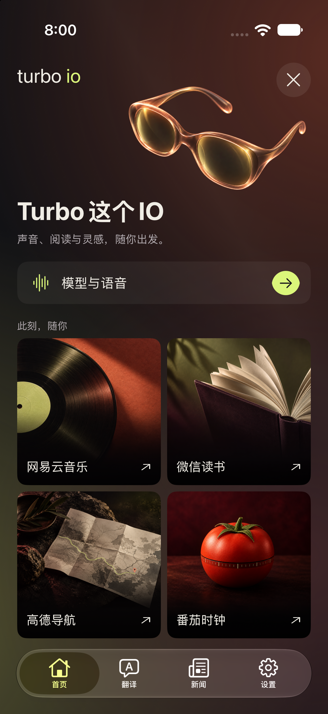
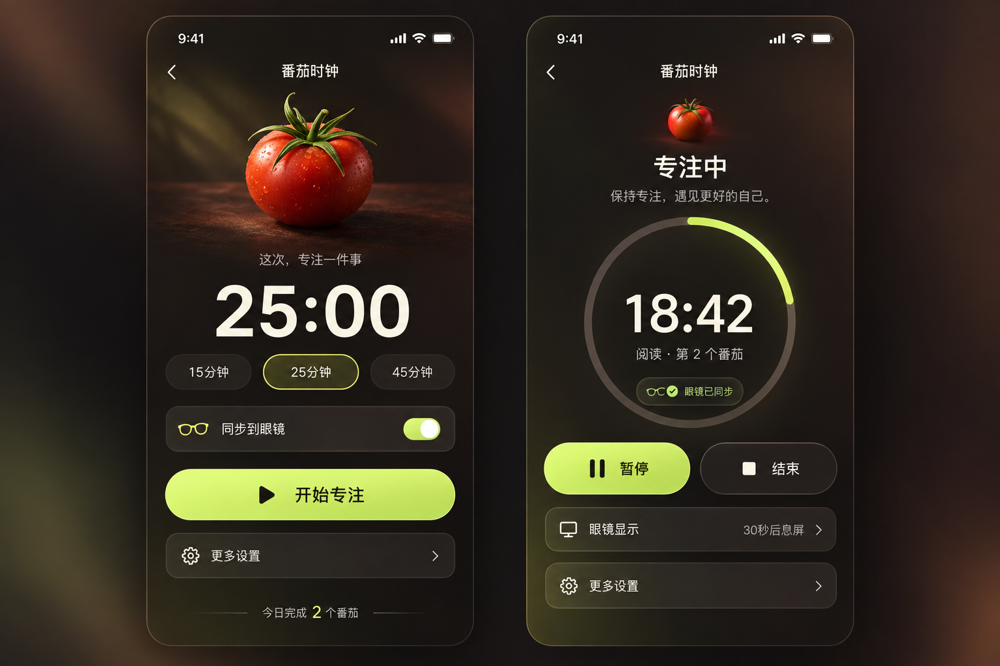
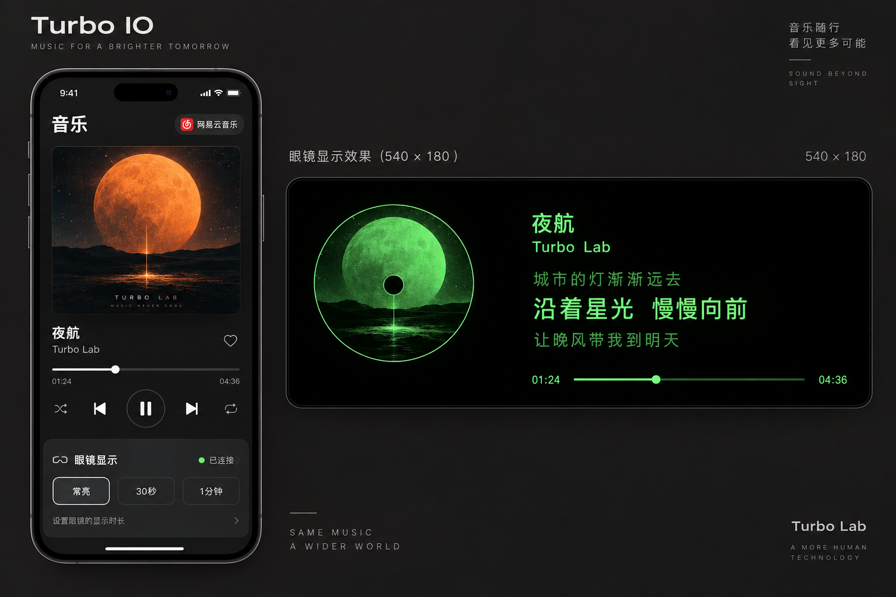
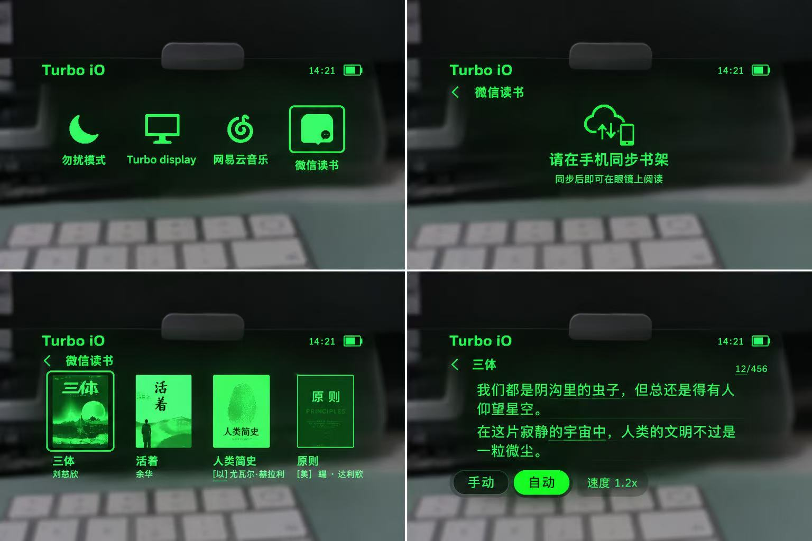

# Turbo IO · 雷鸟 iO / RayNeo iO 非官方 SDK


**Android / iOS 双端源码已公开。** 面向开发者的雷鸟 iO 智能眼镜 SDK、手机 App 扩展与眼镜端应用研究项目：自有 AI、音乐、阅读、导航、番茄时钟，以及可自定义的仪表盘和小应用 SDK。**不是给小白刷机即用的成品。原生鸿蒙 HarmonyOS 已停止更新，保留历史源码供参考。**

*头图为 AI 生成的宣传示意，不是实机截图，不代表官方背书。本文“公开/开源”指列出的原创扩展源码可获取；具体权利以非商业许可证和各第三方许可为准，并非无限制商用授权。*

原创代码仅供学习、研究与非商业使用，沿用 [PolyForm Noncommercial 1.0.0](LICENSE)，未经授权不得商用或收费分发。除源码及明确列出的依赖，Release 提供原厂砸壳 IPA 作为 iOS 扩展输入，以及下述 **Android 1.0.5 非官方完整插件 APK / 高风险实验固件**。原厂部分版权仍归各自权利人，不因分发修改包而重新许可。**不提供个人密钥、Cookie、账号、签名私钥，亦不提供合并后的 IPA / HAP**；第三方服务由用户自行配置。

**文档更新：2026-09-27** · 日期表示文档整理或所注明的实测记录，不代表当天全量回归。

**[Android APK / 固件下载](https://github.com/Turbo1123/Turbo-IO/releases/tag/android-105-guard07-tap1-test01) · [Android 安装与刷机](android-addon/docs/INSTALL_AND_FLASH.md) · [iOS 源码与构建](official-addon/README.md) · [☕ 自愿支持项目](#support)**

## 使用前必读

- **小白不要刷，日常使用请保留官方固件。** 本轮新增的眼镜端原生应用、自定义图形仪表盘与小应用运行时，都需要对应的实验固件；仅安装手机插件不会把这些能力加进原厂固件。已有模型接入、部分字幕等手机侧功能不因此要求刷机。已有匹配运行时后，导入兼容卡片/应用包不必每次重刷。
- **刷机风险由使用者自行评估和承担。** 本项目按现状提供，无稳定性、回滚、救砖或售后保证；掉电、中断、错包和缺陷可能导致数据丢失或设备损坏。在适用法律允许的范围内，作者不承担由此造成的损失或责任。一次实测成功不代表你的设备安全，更不构成“不会刷死”的承诺。
- **鸿蒙 HarmonyOS 不再更新。** 保留既有研究源码和历史验收，不再移植新功能、适配新固件或承诺修复现有问题；新功能以 iOS / Android 各自说明为准，不保证双端完全等同。
- **微信读书、网易云音乐的登录及服务权限请自行解决。** 不提供账号、Cookie、Key、会员权益、代登录或风控绕过；公开版微信读书不含网页正文适配，登录成功也不代表能通过本项目读取所有正文。
- **觉得好用，再自愿打赏。** 不要在打赏前私信要求作者先增加某项功能，也不要把打赏当作功能定制或交付条件。建议可在 Issues 讨论，但不承诺采纳、排期或一对一支持；打赏后同样不产生这些义务。[微信二维码在文末](#support)。

**Android 新发行：[完整插件 APK + TAP1-TEST-01 固件](https://github.com/Turbo1123/Turbo-IO/releases/tag/android-105-guard07-tap1-test01) · [从安装到刷写的逐步教程](android-addon/docs/INSTALL_AND_FLASH.md)**。Fold3 / Android15 的官方升级路径已实刷成功；公开APK移除微信读书网页正文适配，保留书架和TXT阅读。**刷后必须只读回查并解除结果保护，否则安卓官方功能仍会被拦截。** 实验用品，非开发者请勿刷，不保证不会损坏设备。

**开发者新入口：[仪表盘与小应用 SDK 完整教程](docs/DEVELOPER_ECOSYSTEM.md) · [20 个 MCP 应用模板 / ZIP](app-gallery/README.md) · [自托管 API](dashboard-service/README.md) · [Agent 开发 Skill](skills/turboio-developer/SKILL.md)**

MCP 在**用户自己的 Server** 上运行，眼镜不运行 MCP、浏览器或任意 JS。后端取数 → SDK 生成卡片或有界原生应用 → 手机确认 → 眼镜显示。公开模板均为离线示例，不附带账号、Key 或已授权在线服务；真机需要匹配的 TCE1/TAP1 运行时，旧 FOCUS-04 不自动兼容。

**BIG STEP · 从功能，到生态。** 不止使用我们做好的功能：把你自己的数据源，变成眼镜里的仪表盘和原生小应用。[本次更新与价值](#developer-ecosystem) · [从第一个模板开始](docs/DEVELOPER_ECOSYSTEM.md)

[选择平台](#先选开发路线) · [近期更新](#updates) · [功能对比](#各端功能对比) · [AI 帮你接入](#让-claude-code--codex-帮你接入) · [V1 快速开始](#快速开始) · [Web 预览](#web-显示预览与观察台) · [Roadmap](#roadmap) · [许可与隐私](#隐私与许可)

## 先选开发路线

**先按目标选，不必从 V1 源码开始。** 想使用已打包的 Android 研究功能、自己构建 iOS 插件、开发卡片/小应用，是三种不同入口。普通日常用户请使用官方 App 和原厂固件，不要把实验包当作官方更新。

| 你的目标 | 现在提供什么 | 从这里开始 |
| --- | --- | --- |
| **在 Android 使用插件** | 官方 1.0.5（201）宿主已合并 Turbo IO 的完整实验 APK；不用自己合并，服务配置自行填写 | [下载 APK / 配套固件](https://github.com/Turbo1123/Turbo-IO/releases/tag/android-105-guard07-tap1-test01) → [安装与刷机教程](android-addon/docs/INSTALL_AND_FLASH.md) |
| **在 iPhone 使用插件（V2）** | 扩展源码、兼容原厂输入与构建工具；自行合并、签名、安装，**不提供合并 IPA**。新 UI / 番茄有 FOCUS-04 可选集成版 | [宿主与签名要求](official-addon/README.md) → [FOCUS-04 集成版](official-addon/focus-edition/README.md) |
| **开发自己的仪表盘 / 小应用** | 自托管 API、Python / MCP、20 个模板、Agent Skill；先在电脑生成卡片或 ZIP 并预览，再接入匹配手机和运行时 | [开发 SDK 教程](docs/DEVELOPER_ECOSYSTEM.md) · [模板](app-gallery/README.md) · [Skill](skills/turboio-developer/SKILL.md) |
| **只看效果 / 离线学习** | Web UI、模板、SVG 预览与本机测试；不要求设备、服务 Key 或刷机，不等于真机验收 | [Web 预览](#web-显示预览与观察台) · [模板离线入门](docs/DEVELOPER_ECOSYSTEM.md#1-十分钟离线入门) |
| **研究独立连接（iOS V1）** | 独立 SDK 与示例客户端，研究配对、协议和自有 ASR；不是当前 V2 插件的完整替代品 | [V1 快速开始](#快速开始) |
| **研究鸿蒙 HarmonyOS** | **已停止更新**，仅保留 HarmonyOS 6.1 历史源码与验收；不跟进新功能、新固件 | [历史安装与限制](harmony-sdk/README.md) |

**要不要刷固件？** 模型接入、TTS、部分字幕等手机侧扩展可沿用原厂显示能力；新增的眼镜原生应用、图形仪表盘与四槽小应用需要对应实验运行时。已有兼容运行时后，导入兼容卡片/ZIP 不必每次重刷。**安装 APK ≠ 安装眼镜固件；iOS / Android 的 OTA 门禁和候选也不能混用。** [查看平台与固件差异](#各端功能对比)。

**连接与安装：** iOS / Android 扩展沿用宿主配对，不需要为插件反复解绑；Android 重签名 APK 不能直接覆盖签名不同的旧 App，先导出数据再按教程处理。只有切换到 V1 / 鸿蒙独立客户端时，才按对应流程解绑旧宿主、在原手机系统蓝牙忽略设备，不能让多个客户端争抢连接。Android 刷完还必须完成只读回查与解除结果保护。

<a id="updates"></a>

## 近期更新与眼镜端应用

按日期倒序整理；每项单独标注公开范围与验收边界。

| 日期 | 更新 | 公开范围 |
| --- | --- | --- |
| 2026-09-27 | [Android 1.0.5 完整插件与官方流程 OTA](#android-release-update) | 去除网页正文适配的完整APK、扩展源码、TAP1-TEST-01原样实刷固件、校验与逐步教程；高风险实验版 |
| 2026-09-26 | [开发者生态：应用广场、仪表盘与 App SDK](#developer-ecosystem) | 自托管 API / Python / MCP、20 个离线模板 ZIP、Agent Skill、协议参考源码；配套完整固件不在本次发布内 |
| 2026-09-25 | [重磅更新：新 UI、四项菜单、原生番茄时钟](#focus-update) | FOCUS-04 原创源码、配套 iOS 插件与精确实刷实验固件；不含私人配置或网页正文适配 |
| 2026-09-24 | [本地翻译与英语离线字幕](#local-translation) | Apple / Hy-MT2 / Parakeet 源码、模型下载与可选 iOS 构建；不含权重或密钥 |
| 2026-09-24 | [微信读书：四本书架与阅读页](#weread-research) | TWR1 原创模块、构建工具与实刷实验固件；不含网页正文适配 |
| 2026-09-23 | [网易云音乐：第十项菜单](#music-app) | TMU1 源码、配套手机代码与实测实验固件 |
| 2026-09-22 | [Turbo Display 与原生导航](#native-apps) | TDP1/TNV1 源码、配套手机代码与匹配固件 |
| 2026-09-22 | [ANIM60 本地动图](#animation-test) | 动图实验源码与独立固件候选；非通用动图上传 |

> **自定义固件是试验用品，非开发者请勿刷。** AP 改动仍可能导致无法启动或失去 OTA；不要混用不同候选的固件、手机门禁或授权。原厂回滚不是救砖保证。实机成功不等于生产稳定版。

<a id="android-release-update"></a>

### 2026-09-27 · Android 1.0.5 完整插件与实验 OTA



**[下载完整 APK / TAP1-TEST-01 / 校验文件](https://github.com/Turbo1123/Turbo-IO/releases/tag/android-105-guard07-tap1-test01) · [完整安装与刷机教程](android-addon/docs/INSTALL_AND_FLASH.md) · [公开范围与源码构建](android-addon/README.md)**

*横版更新说明由 imagegen 生成，不是实机截图，也不能代替完整教程。公开 APK 不含微信读书网页正文适配或私人配置；公开派生包尚未再次实机刷写。眼镜自然重启后，必须按教程只读回查并解除结果保护；更新未结束或状态不明时不能释放。*

<a id="developer-ecosystem"></a>

### 2026-09-26 · BIG STEP：从内置功能，走向开发者生态


*AI 生成的开发者生态效果示意，不是镜片实拍；图中数据与界面为示例，音乐模板不播放音频。开放的是开发接口与有界组件能力，不是无限系统权限。配套 TAP1 实验固件于 09-27 单独发布，见顶部下载入口。*

**这次的价值，是把“我们替你做功能”推进到“你也能为眼镜开发功能”。** 在匹配运行时支持的组件范围内，新增信息卡或小应用可以通过数据和 ZIP 完成，不必为每个页面重新修改 AP。需要新系统能力、底层协议或运行时之外的组件时，仍需固件开发；不是任意网页或 JS 都能装进眼镜。

| 这次开放了什么 | 用户能用它做什么 |
| --- | --- |
| 仪表盘组件、JSON 约束与后端 API | 把额度、天气、日程、设备状态等自有数据排成信息卡，复用图标、进度条和图表 |
| 小应用描述、打包校验与原生运行时参考源码 | 用受约束的页面和交互生成 ZIP，在匹配运行时导入、查询四槽、启动小应用 |
| 自托管 HTTP / Python / MCP | 数据源和凭据由用户自己掌管，不依赖作者的私人服务器 |
| 20 个离线模板、可复制提示词与 Agent Skill | 从已有例子起步，让 Agent 按尺寸、组件和内存限制生成、检查、打包，而不是从头猜协议 |

**更新清单：** 应用广场整理为三个入口；进入“我的应用”自动查询四槽（受连接、忙碌和升级保护限制）；新增 20 个可下载 ZIP 与来源说明；补齐仪表盘/小应用后端开发教程、12 个 MCP 工具及 Agent Skill。手机配套研究版还加入了仪表盘草稿预览列表；本 PR 的公开仪表盘范围是模型与后端接口参考，未包含该完整编辑器 UI。

应用广场分为 **我的应用 / 应用广场 / 开发指南**。保留四个基础示例，新增天气、降雨、通勤、余票、航班、日程、待办、知识便签、阅读摘记、代码与服务状态等 **20 个可修改的离线模板**。每个都有图标、内容、接入要求、ZIP 和可复制 Agent 提示词。眼镜最多安装四个小应用、一次运行一个，广场条目不会自动全部安装。

```sh
npx skills add Turbo1123/Turbo-IO --skill turboio-developer -g
```

把需求与选中的模板提示词交给 Agent，让它连接**你自己的 Server / MCP**，保留最少展示字段，生成并验证小包；密钥始终留在服务端。手机、仪表盘、应用包的开发与打包细节统一放在[开发教程](docs/DEVELOPER_ECOSYSTEM.md)，避免主 README 堆积命令。

- **仪表盘 SDK**：256×194 卡片，文字 / 图标 / 图片 / 进度条 / 柱图 / 折线；后端草稿、revision、发布、手机批准与回执。
- **App SDK**：540×180，最多四页，JS 仅用于开发电脑构建；ZIP 解压预算 20 KiB。眼镜使用有界原生组件，不执行 ZIP 中的代码。
- **独立后端**：HTTP API、Python SDK、12 个 MCP 工具，无作者私有服务依赖。

**边界：** 本版小应用使用版本化快照与手机手动导入，自动后台刷新、按钮回传 Server 和队列恢复尚未接通。20 个模板不是 20 项联网成品；公开 API/打包工具可以独立运行，手机模块是集成源码，不是签名安装包。私用匹配运行时的基础安装已有用户实测反馈，但本次不发布新的可刷固件，也不把模拟器测试当镜片验收。

**开放开发能力，不取消安全边界：** 最多四个已安装应用、一个前台实例、每包最多四页、每页最多 12 个组件；解压后总预算 20 KiB，ZIP 上限 24 KiB。保留手机确认与协议校验，眼镜不运行 MCP 或任意脚本；API Key、Cookie、签名证书和私用安装包不随源码发布。先在电脑运行模板与后端测试，再处理匹配手机和固件集成。详见[公开范围与兼容前提](docs/DEVELOPER_ECOSYSTEM.md)。

[20 个模板及来源](app-gallery/README.md) · [API 与安装步骤](docs/DEVELOPER_ECOSYSTEM.md) · [手机集成边界](official-addon/research/app-runtime-v1/README.md)

<details>
<summary>查看应用广场界面</summary>



隔离模拟器运行截图，不是镜片实拍，也不代表已连接上游 MCP。
</details>

<a id="focus-update"></a>

### 2026-09-25 · 中秋重磅更新：全新 UI 与 FOCUS-04

1. **菜单重构**：眼镜菜单四项同屏，明显选中框，左上角时间与电量；详情页不再残留菜单滚动指示器。
2. **修复遗留固件问题**：优化音乐旋钮轻触误切歌、文字边距、微信读书长按返回/退出与番茄页面重叠。
3. **新增原生番茄时钟应用**：眼镜第十二项菜单，手机双向控制，短按暂停/继续、长按停止；息屏继续计时、到时空闲提醒，避免长期亮屏打扰。
4. **Turbo IO 插件 UI 焕新**：首页眼镜动效、音乐/微信读书/导航/番茄卡片，整理内页与设置；只改自己的插件，不重做官方 App。

**[FOCUS-04 固件与构建校验](firmware-research/strix-1.0.4.12/native-navigation/focus/README.md)** · **[配套手机构建和使用](official-addon/focus-edition/README.md)** · **[下载实验固件](https://github.com/Turbo1123/Turbo-IO/releases/tag/firmware-strix-1.0.4.12-tfp1-focus04)**

基于 Strix OS 1.0.4.12，仅 AP 内容变化，其他 13 个固件负载不变；AP **9,558,216 字节**，低于 9,600,000 字节限制。2026-09-25 用户实刷并确认此版正常；仍是试验用品，不代表全场景稳定、不会变砖或可保证救砖。配套宿主为雷鸟 AI **iOS 1.0.5（201）**，不可与旧包/门禁混用。



[完整更新长海报](docs/screenshots/midautumn-update-20260925.png)。界面效果示意，不是镜片实拍；微信读书公开版正文需自行合法导入。

<details>
<summary>查看首页、番茄时钟与音乐单独效果图</summary>






首页为模拟环境界面；番茄与音乐为设计效果，不作为实机像素一致性或完整验收证据。
</details>

<a id="local-translation"></a>

### 2026-09-24 · 本地翻译与英语离线字幕

公开 **Apple 本地翻译、Hy-MT2 文字翻译和 Parakeet 英语离线 ASR**，支持手机/系统可用的蓝牙麦克风、快速预译、原文与译文同步眼镜。运行在 iPhone，**无需服务 Key、无需刷眼镜固件**；是独立字幕入口，不是全面替换官方翻译所有功能。iOS 26+ 可选构建，首次需自行准备模型与系统语言包，不提供签名 IPA 或权重包。

[下载、构建、签名与使用教程](official-addon/local-translation/README.md) · [模型及第三方许可证](official-addon/local-translation/THIRD_PARTY.md) · [验证与限制](official-addon/local-translation/VALIDATION.md)。英语识别不是多语言 ASR；眼镜专有前方/四周定向收音尚未接入，前台采集、20分钟保护，无自动云端兜底。公开源码已编译并做离线测试，完整公开包与镜片仍需使用者验收。

<a id="weread-research"></a>

### 2026-09-24 · 微信读书研究：四本书架与原生阅读页

**新增第十一项“微信读书”研究菜单：四本封面书架、原生文本窗口与手动/自动滚动。** 已公开[原创 AP / 手机模块、构建与协议说明](firmware-research/strix-1.0.4.12/native-navigation/weread/README.md)，以及 [TWR1 实刷实验固件](https://github.com/Turbo1123/Turbo-IO/releases/tag/firmware-strix-1.0.4.12-twr1)。源码重建 AP 与实刷版本一致，仅 AP 改变，其他13个负载不变。**旧 TWR1 的长按返回问题在 09-25 FOCUS-04 中加入修复，旧 Release 不变。非开发者请勿刷，不保证回滚或救砖。**

手机模块公开书架/统计、封面处理、TXT/EPUB 导入及阅读传输，**不含网页正文适配、Cookie、Key 或私用 IPA，也尚未接入主仓库默认构建及 TWR1 OTA 打包入口**；没有自己的匹配手机集成时先别刷。这不是“下载源码就能直接读取所有微信读书正文”的声明。书架/统计参考 [Tencent/WeChatReading](https://github.com/Tencent/WeChatReading)，网页阅读可自行研究 AGPL 项目 [finlater/weread.koplugin](https://github.com/finlater/weread.koplugin)。[架构思路与许可范围](docs/WEREAD_RESEARCH.md)



上述集成限制针对历史 TWR1；09-25 新增的 [FOCUS-04 可选集成版](official-addon/focus-edition/README.md)已提供匹配的构建与 TFP1 打包入口。网页正文适配仍未公开，本机 TXT/EPUB 导入范围不变。

*界面效果示意（用户提供）：展示菜单、同步提示、四本书架与阅读布局，不作为实机验收证据；图中书籍、文字、页码和速度仅为示例，具体交互以研究说明为准。*

<a id="music-app"></a>

### 2026-09-23 · 网易云音乐：眼镜第十项菜单

**2026-09-23 研究机实测通过**：配套 iOS 播放器有声音、封面和歌词；眼镜显示旋转专辑封面与**五行歌词，当前句始终在中间高亮**，暂停/继续、切歌、拖动进度同步正常。手机发起播放与眼镜反向请求均有代码支持；不保证 App 被系统终止后能自动拉起。

- **新增第十项音乐菜单**，保留原七项、第八项 Turbo Display/ANIM60 和第九项原生导航。
- 手机负责获取可播放歌曲、封面和歌词以及播放音频；眼镜 AP 原生绘制，不持续传整屏截图。可选常亮 / 30秒 / 60秒显示。
- **旧 TMU1 已知问题：轻碰旋钮可能误切歌。09-25 FOCUS-04 已加入输入过滤与去抖，旧 Release 不变。** 扫码登录可能报“环境异常”，本次用未登录可播放歌曲验收，不绕过风控、会员或版权限制。
- 适配 **雷鸟 AI iOS 1.0.5（201）+ Strix OS 1.0.4.12**，Android / HarmonyOS 暂未接入此音乐播放器。

**[完整教程：构建、签名、试刷、播放与协议](firmware-research/strix-1.0.4.12/native-navigation/music/README.md)** · **[下载 TMU1 实测固件 Pre-release](https://github.com/Turbo1123/Turbo-IO/releases/tag/firmware-strix-1.0.4.12-tmu1)**。发布源码、精确实测固件及校验工具，不提供合并 IPA、个人签名、Key、账号或 Cookie。

> **试验用品，仅供开发者非商业学习研究，非开发者请勿刷！** 仅 AP 内容改变、其他13项保持原厂字节，清单更新 AP Size/MD5；不代表 OTA 只写 AP，也不保证不会变砖。断电、中断、错误固件可能导致无法启动或失去 OTA，原厂回滚不是救砖保证。实测通过不等于生产稳定版。普通 SDK/App 开发无需刷固件。

<a id="native-apps"></a>

### 2026-09-22 · Turbo Display 与原生导航应用

**这次不只是“把导航测试文字发到眼镜”，而是在眼镜端增加了独立的导航应用页面。** **Turbo Display 保留为开发者的传图／显示测试工具，不是面向日常使用的显示应用**；新增导航则是拥有独立菜单入口、布局和运行状态的应用页面。两者定位不同。

| 功能 | Turbo Display · 显示测试（Test） | 原生导航 · TNV1 |
| --- | --- | --- |
| 用来做什么 | 验证传图、像素渲染、局部更新与显示协议 | 手机规划路线，眼镜原生绘制导航界面 |
| 眼镜入口 | 第八项 **Turbo Display** | 新增第九项 **导航**，原七项与 Turbo Display 保留 |
| 怎么更新 | 手机处理图像，发送完整图或局部像素更新 | 手机发送转向、距离、路名和路线点；眼镜用 LVGL 绘制 |
| 显示内容 | 当前 512×128 灰度画布；镜片呈现绿色单色图像 | 540×180 布局：方向箭头、距离、路名、剩余信息、路线示意图 |
| 适合什么场景 | 开发调试、测试图与协议验收；不是日常应用或视频投屏 | 持续变化的导航指引，无需每次传一整张导航图片 |

#### 导航应用：独立入口与原生绘制

- **独立入口与生命周期**：眼镜菜单中有“导航”；手机开始后可主动打开，不必每次先去官方字幕或提词器操作一遍。
- **眼镜端原生绘制**：内置转向图标、文字与路线示意图。手机只发导航数据，单次完整快照最多 **328 B**，减少旧传图方案的带宽负担；这不是无延迟保证。
- **高德提供路线，眼镜呈现指引**：手机支持步行、骑行、驾车的规划/导航入口；路线示意图不是高德完整地图底图，也不是路口实景。
- **显示与退出管理**：实现了停止/实体返回收尾、无有效更新约60秒息屏、按键唤醒及可选常亮；各分支仍需扩大验收，不承诺绝不熄屏。
- **后台导航已修复立即退出问题**：配套 iPhone Air 版收到用户正常反馈；真实导航按授权使用后台定位，模拟后台仅短时测试。见[后台行为与限制](official-addon/docs/NAVIGATION_BACKGROUND.md)。

这里的“应用级别”指**集成在固件 application 内、拥有独立菜单和交互的原生应用页面**，不再借用旧测试界面；并不是已经开放 Android 式 APK 安装、任意第三方 App 加载或整个系统 UI 替换。

**实机进展（2026-09-22）**：Turbo Display 完整图和局部更新已有镜片反馈；TNV1 已刷入并进入独立导航页，手机发起导航及后台修复获用户初步正常反馈。新增应用不等于生产稳定版，长期运行、全部模式、低电量和异常恢复仍需专项验证。

**TNV1 匹配版本已公开：** [下载高风险固件 Pre-release](https://github.com/Turbo1123/Turbo-IO/releases/tag/firmware-strix-1.0.4.12-tnv1) · [完整源码、构建与手机合并](firmware-research/strix-1.0.4.12/native-navigation/BUILD.md) · [升级、导航与传图测试说明](firmware-research/strix-1.0.4.12/native-navigation/USAGE.md)。此包保留 **Turbo Display 测试工具**并新增**独立原生导航应用**，含配套 iOS 1.0.5（201）源码与后台修复；仅 AP 内容变化，另13项不变。使用自己的配置和签名，不提供合并后 IPA。旧 R3 Release 不含这两项，不能混用。**非开发者请勿刷；实机成功不代表不会变砖或保证救砖。**

<a id="animation-test"></a>

### 2026-09-22 · ANIM60：眼镜端本地动图实验

ANIM60 是基于相同 Strix OS 1.0.4.12 的**另一份实验 AP**：复用第八项 Turbo Display，内置 12 帧素材、在眼镜端定时绘制，手机无需逐帧传输。2026-09-22 研究机已刷入，用户确认动画播放，30 秒结束计数 1799 次提交；这是约 60 次/秒的**提交计数**，不是物理面板 60 FPS 的测量，也未证明长期热稳定或全部情形无丢帧。它不是 GIF 上传器或面向普通用户的动画 App。

[查看素材预览、实测边界、AP 校验值与离线重建](firmware-research/strix-1.0.4.12/native-navigation/animation/README.md) · [ANIM60 高风险实验固件 Pre-release](https://github.com/Turbo1123/Turbo-IO/releases/tag/firmware-strix-1.0.4.12-anim60)。ANIM60 与 TNV1 是不同固件候选，不能混用升级授权或手机端门禁；公开源码目前不提供 ANIM60 专用手机 OTA 操作入口。**普通 SDK/App 开发不需要刷固件。**

> **仅限开发者的非商业学习研究，有风险，不是日常导航产品。** 不在驾驶、骑行或过马路时操作/测试；可能出现断连、延迟、旧指引或熄屏。使用自定义固件还可能无法启动或失去 OTA，原厂回滚不是救砖保证。普通 SDK/App 开发不需要刷固件。

<details>
<summary>早期 R3 固件验证：为什么只修改 application？</summary>

> **试验用品，不是日常固件；非开发者请勿尝试，务必不要随便刷。** 本次要验证的是能否经官方 OTA 运行修改后的 AP、能否开发眼镜端页面并显示 PNG，不是为了做固件而做固件，也不是推荐替换官方系统。

2026-09-21，基于 **Strix OS 1.0.4.12** 的 Turbo Photo R3 获得用户真机确认：更新后显示自定义图片，图片页可退出并再次进入。仅 AP 负载改变，另 13 项不变；不等于完整 OTA 只写 AP。**不保证回滚或救砖**：掉电、意外中断、版本不匹配、错误代码/资源都可能导致无法启动或失去 OTA。不能宣传“几乎刷不死”。

**为什么只改 application（`nuttx_ap.bin`）？** 菜单、页面和 PNG 显示的目标代码位于 AP；先把改动限制在这里，保留其余原厂组件，减少变量与额外风险，验证眼镜应用/UI 扩展能力，而非重写系统。AP 不是隔离沙盒，错误仍可能导致整机无法启动；“只改 AP”不是不会变砖的保证。[设计取舍](firmware-research/strix-1.0.4.12/docs/PROCESS.md)

**[研究过程、源码、已知问题与离线测试](firmware-research/strix-1.0.4.12/README.md)** · **[实验固件 Pre-release 与校验值](https://github.com/Turbo1123/Turbo-IO/releases/tag/firmware-strix-1.0.4.12-turbophoto-r3)**。普通 SDK/App 开发不需要刷这个固件。R3 只验证嵌入图片页，不含后续 TDP1 传图和 TNV1 导航；它不是通用眼镜 App 安装系统，长期稳定性和故障恢复未验。

</details>

## iOS 原厂砸壳 IPA 下载

**[雷鸟 AI iOS 1.0.5（201）原厂砸壳 IPA](https://github.com/Turbo1123/Turbo-IO/releases/tag/rayneo-ios-1.0.5-201)**。

提供的是**原厂应用的砸壳（解密）版本，未合并 Turbo IO 扩展，不是修改功能后的版本**。砸壳是对原应用二进制解除加密，不代表整个文件与 App Store 原始加密包逐字节相同。下载该 IPA 不会直接获得 Turbo IO 功能；需按 [iOS 扩展教程](official-addon/README.md) 自行合并、配置并使用自己的签名安装。

<details>
<summary>版本、校验值与版权说明</summary>

**版权归雷鸟及相关权利人所有。** 该 IPA 是二进制应用副本，不是官方应用源码；本仓库的源码许可证不适用于该 IPA。附件不含维护者个人 Apple 开发者签名、描述文件、服务密钥或账号数据，也不是为你的设备预签名的安装包。

- 文件：`RayNeo_AI_1.0.5_201_decrypted_original.ipa`
- 版本 / Build：`1.0.5 / 201`；Bundle ID：`com.rayneo.venus.pub`
- SHA-256：`39d12aff8f2b312dc3b40ce784a444e52c536e61378434005255177548df966a`
- 普通 App Store 加密 IPA 仍不能直接合并；未知版本必须通过兼容性检查。项目不提供代砸壳或代签名服务。

</details>

## 各端功能对比

### 手机版本怎么选（2026-09-27）

下表比较**当前公开的内容与接入方式**，不把“有源码”“已打包”和“真机全量通过”混为一谈。V1/V2 是架构路线，1.0.5 是官方宿主版本；GUARD-07、FOCUS-04、TAP1 则是不同扩展/固件标记，不是同一组版本号。

| 差别 | Android 1.0.5 · GUARD-07 | iOS 官方扩展 · V2 | iOS 独立 SDK · V1 | 鸿蒙 HarmonyOS |
| --- | --- | --- | --- | --- |
| 交付形态 | **完整实验 APK + 源码** | **源码**；自行合并签名，无合并 IPA | SDK + 示例客户端源码 | 历史源码，无 HAP；**停止更新** |
| 连接 / ASR | 复用官方宿主连接与 ASR | 复用官方宿主连接与 ASR | 独立连接、自有 ASR | 独立连接、自有 ASR；历史验收 |
| 自有模型 / 搜索 / TTS | 配置与实现已集成；凭据自备 | 模型、TinyFish、本机/云端 TTS；按构建说明启用 | 自有模型/语音路线；不等于 V2 模块齐全 | 保留原有自有语音；不跟进新模块 |
| 音乐 / 阅读 / 原生导航 / 番茄 | 已集成对应手机模块，需匹配实验固件 | 有对应公开模块；FOCUS-04 提供可选集成构建，不能混用历史候选 | 不作为该路线的完整集成功能 | 无当前这组原生应用移植 |
| 微信读书正文 | **本地 TXT**、原创示例；不含网页正文/Cookie入口 | FOCUS-04 支持本地 **TXT / EPUB**；不含网页正文适配 | 不能视作同一套微信读书客户端 | 未移植当前阅读应用 |
| 本地翻译 / 离线 ASR | **未移植**；云端字幕另行配置 | **可选 iOS 26+** Apple / Hy-MT2 / Parakeet 模块，模型与语言包自备 | 未接该独立模块 | 未接 |
| 仪表盘 / 四槽应用广场 | 当前 APK 已集成入口与 20 个离线模板；需 TCE1/TAP1 | 已公开协议及手机参考模块，**需自行集成**；旧 FOCUS-04 不自动包含 | 不默认提供 | 不跟进 |
| 刷机方式 | 当前 Release 固定 TAP1-TEST-01，沿官方 OTA，**刷后人工回查并释放保护** | 按所选 iOS 集成版匹配固定固件/门禁，自行构建签名 | 不提供当前 Android OTA 工作流 | 无当前刷机流程适配 |
| 验收边界 | Fold3 / Android 15 私用前身实刷通过；公开删减 APK 构建/审计通过，未再次实刷 | 各模块有各自研究验收；公开重建包、签名和所选组合仍需验证 | 仅适用 V1 已记录结果 | Mate X5 / HarmonyOS 6.1 历史结果，不保证新固件 |

**共同限制：** 自备模型/地图等配置；微信读书、网易云登录与服务权限自行处理；无私人凭据、代登录或风控绕过。云服务、系统权限、长时后台和其他机型不保证一致，不能用某一端的成功证明另一端已验证。

### 眼镜固件有什么差别

| 固件 / 运行时 | 主要能力与用途 | 配套要求 |
| --- | --- | --- |
| **原厂 Strix OS** | 官方菜单和功能；手机扩展可利用已有文字/字幕等通道，但没有我们的原生新菜单、TCE1图形编辑运行时或TAP1四槽应用 | 普通用户首选。保留官方 App / 固件；原厂有限卡片不等于新仪表盘 SDK |
| **FOCUS-04 / TFP1**（历史实验版） | 四项同屏菜单、原生番茄；包含音乐/阅读交互等修复。**不包含后来的 TCE1/TAP1 运行时** | [FOCUS-04 iOS 集成版](official-addon/focus-edition/README.md)与该 Release 固定固件；不是 Android GUARD-07 的升级候选 |
| **TAP1-TEST-01**（当前 Android 实验发行） | 此前 TAP1 有界四槽小应用运行时及仪表盘能力；相对 spacefix-c 仅将菜单标记改为“显示TEST”，不是全新功能重写 | [GUARD-07 APK + 同一 Release 的精确 ZIP](android-addon/docs/INSTALL_AND_FLASH.md)；TCE1/TAP1手机桥必须匹配。不能拿 FOCUS-04 的 iOS 门禁直接刷 |
| **R3 / TDP1 / TNV1 / ANIM60 / TMU1 / TWR1**（历史研究包） | 分别研究图片、传图、导航、动图、音乐、阅读；各自对应当时源码与验收 | [固件研究索引](firmware-research/strix-1.0.4.12/README.md)。不是需按顺序安装的“补丁”，不建议为了追版本逐个刷 |

**不是固件越新就可以随便升级。** FOCUS-04 与 TAP1-TEST-01 均基于 Strix OS 1.0.4.12，系统版本数字可能不变；必须核对 Release 名、SHA-256、宿主和门禁，不只看“1.0.4.12”。所有自定义固件均是高风险实验包，不保证回滚或救砖。

### 历史逐项验收记录

以下为 **2026-09-24 历史对照**，保留以便追溯，不用于判断当前 Android 是否已移植。当前范围以本节上表及各模块文档为准；鸿蒙已停止更新。

**实测**＝有对应路线的真机/镜片反馈；**部分**＝仅部分流程通过或仍有已知问题；**待验**＝已有代码，但尚未完成对应真机闭环；**未接**＝本路线未集成；**官方**＝沿用宿主能力，不代表扩展重写或重新验收。历史私用前身的反馈不能保证你自己编译的包、其他固件和机型全部可用。

<details>
<summary>展开 09-24 四端历史功能与验收对比</summary>

| 功能 | iOS 独立 SDK · V1 | iOS 官方扩展 · V2 | Android 官方扩展 | 原生鸿蒙 HarmonyOS |
| --- | --- | --- | --- | --- |
| 应用形态 / 连接 | **实测**：独立配对，复用厂商通信库 | **官方**：保留登录、配对与连接 | **官方**：保留登录、配对与连接 | **实测**：原生独立配对、认证、初始化 |
| 免越狱 / 免 Root | 非越狱 iPhone 已验 | 非越狱 iPhone 已验，需兼容未加密输入 | 非 Root 设备已验，需兼容 APK | 无需 Root；Mate X5 已验，无需官方包 |
| 语音识别 ASR | 自有阿里流式 ASR / 云 VAD | 沿用官方 ASR | 沿用官方 ASR | 自有阿里流式 ASR / 云 VAD |
| 本地翻译 / 英语离线字幕 | **未接此模块** | **可选 iOS 26+**：Apple / Hy-MT2 翻译、Parakeet 英语识别；公开构建和测试通过，真机组合链待复验 | **未接** | **未接** |
| 自有模型 → 镜片回答 | **实测**：支持流式显示 | **实测**：支持流式显示 | **实测**：支持流式显示 | **实测**：当前非 SSE，取回后分段显示 |
| 回答同步朗读 TTS | **未接此扩展** | **云端私用版实测**：官方/自有回答各完整朗读一次；**本机默认模式待镜片听感验收** | **未接** | **未接** |
| 音乐封面 / 五行歌词 · TMU1 | **未接** | **实测**：可选音乐构建 + TMU1固件；旋钮误切歌为已知问题 | **未接** | **未接** |
| 插话 / 回答后自动关闭 | **实测** | **部分**：有研究实测，依赖官方会话事件 | **实测**：研究设备通过 | **部分**：退出已验；WB14 插话改动待复验 |
| TinyFish 联网搜索 | 未接专用工具 | **实测**：需自有 Key | **实测**：需自有 Key | **待验**：工具代码已接，默认关闭 |
| Codex / 知识库 | **实测**：发任务、查结果、完成通知 | **待验**：只读服务/Tools 已有，公开版全链路未验全 | **待验**：查询/状态适配代码已有 | **未接** |
| 录音与文字导出 | **部分**：短录音接收、手动 ASR 通过；长录音/完整分享待验全 | **部分**：本机音频分享、转写整理；不保证完整官方历史 | **部分**：本机录音选择/分享已验，不重建完整智记 | **部分**：眼镜起录可用；手机起录及完整导出待验 |
| 全天智记 | **待验**：正式文字专用链路、持久恢复、按日归档与导出已实现；A3、后台和长时运行待真机验收 | **部分**：开启保存后的片段导出，不补历史音频 | **未完整移植** | **未完成完整链路** |
| 待办下发 / 双向同步 | **部分**：新增/发送可用，眼镜完成回传仍有问题 | **部分**：自然语音创建已验，网页全链路双向未验全 | **官方**待办；扩展双向未完整移植 | **部分**：下发镜片已验，反向完成待验 |
| 提词器 / AI 新闻 | **部分**：传稿、TXT/EPUB 书稿；未接新闻生成 | **部分**：新闻长稿滚动已验，重启准备/速度未验全 | **官方**提词；AI 新闻未完整移植 | **已知问题**：眼镜菜单未知错误，列表握手未齐 |
| 天气 → 眼镜首页 | **部分**：自有天气已接，部分镜片验收 | **官方**，不算独立天气移植 | **官方**，不算独立天气移植 | **部分**：模拟天气镜片已验，实时服务需配置/复验 |
| 地图搜索 / 算路 | **未接本仓库导航模块** | **部分**：地图搜索、三种模式入口；逐模式未验全 | **实测**：地图/搜索，三种模式规划返回路线 | **部分**：POI/步行算路已验；手机底图白屏 |
| 导航 → 眼镜持续指引 | **未接** | **部分**：模拟镜片已验，4 分钟保护 | **部分**：真实路线文字已验；新增模拟模式待验，4 分钟保护 | **部分**：步行模拟镜片已验，骑行/驾车待验 |
| 真实外场 / 长期后台导航 | **未接** | **未完整验收**，不作为已完成能力 | **未完整验收**，前台研究指引 | **未完整验收**，离页/后台停止导航 |
| 主动自定义文字通知 | **实测**：手动及 Codex 完成通知；非 APNs | 扩展主动推送未完成；APNs 未接 | 扩展主动通知未完整移植 | **待验**：手动指令与总开关已接 |
| 其他 App 系统通知转发 | iOS 系统共享通知，需用户授权 | 沿用官方/系统权限；不保证重签后官方推送 | 沿用官方通知能力与权限 | **未实现**：需受限订阅权限、扩展和用户授权 |
| Web 显示观察 | **实测**：USB 状态观察＋样式预览，非像素投屏 | 不把 V1 观察能力直接套用 | 未迁移 V1 观察接口 | 未迁移 V1 观察接口 |

</details>

**默认原厂固件与自定义固件是两条路线：** 原厂固件下的有限卡片/通知模板不等于自由替换系统 UI；自定义 AP 路线已发展到 Turbo Display 和独立导航应用，但需要匹配固件与手机实现，不能直接套到四端。Claude Code、Hermes、WorkBuddy、OpenClaw 也不能仅凭下拉选项视作已接通。

详细证据与使用限制：[iOS V1](#能力与边界) · [iOS V2](official-addon/docs/VALIDATION.md) · [Android 当前发行](android-addon/README.md) · [鸿蒙历史验收](harmony-sdk/VALIDATION.md)。Android 已提供独立研究签名的完整实验 APK；iOS 仍需自行合并、构建与签名，不提供合并 IPA，鸿蒙不提供 HAP。各端服务配置均由用户自行准备。

### 通知与权限，先看这里

- **自定义测试通知**：App 主动发送一段文字到眼镜，不等于读取微信等其他 App 的通知；需要眼镜连接并开启应用内通知总开关。
- **iOS 系统通知**：需允许系统蓝牙设备的“共享系统通知”，且来源 App 自身获准通知；具体以系统设置和对应客户端为准。
- **鸿蒙系统通知转发尚未实现**：需要 `ohos.permission.SUBSCRIBE_NOTIFICATION`、符合要求的签名/证书授权、通知订阅扩展及用户授权。普通应用通知开关、蓝牙权限、在清单声明一行权限，都不等于已获得读取其他 App 通知的能力。**不要为此盲目修改签名等级或 Root。** [鸿蒙权限与已知限制](harmony-sdk/README.md#通知与权限)

## 让 Claude Code / Codex 帮你接入

**Android：[雷鸟 AI Android 官方下载入口](https://rayneo.cn/commonPage/venus/appDownload/index_m.html)** · **[完整 AI 接入说明](docs/AI_SETUP.md)**

**iOS：可使用上方 Release 提供的原厂 1.0.5（201）砸壳 IPA，或自行准备有权使用的兼容未加密副本。提供的 IPA 没有 Turbo IO 扩展，需自行合并和签名；普通 App Store 加密 IPA 不能直接合并。**

Android 用户把**官方下载入口 + 本仓库 + 下面的提示词**一起交给电脑上的 Claude Code 或 Codex；iOS 官方扩展用户可同时提供上方原厂砸壳 IPA Release 链接，或自行准备合法兼容的未加密应用副本。原生鸿蒙 HarmonyOS 用户只需本仓库与提示词，不需要官方包。再让助手按所选路线检查环境、编译并引导配置；只有官方扩展需要合并宿主。不需要先弄懂所有脚本；但你仍需提供自己的签名、服务配置并完成手机授权和镜片验收。仅聊天、不能访问本机文件和终端的环境不能替你完成真机安装。

<details>
<summary>展开可复制给 Codex / Claude Code 的接入提示词</summary>

复制下面整段，选择括号里的目标：

```text
请帮我在这台电脑上接入 Turbo IO，仅用于个人非商业学习研究。
源码：https://github.com/Turbo1123/Turbo-IO
Android 官方 App 下载入口：https://rayneo.cn/commonPage/venus/appDownload/index_m.html
iOS 官方扩展原厂砸壳 IPA：https://github.com/Turbo1123/Turbo-IO/releases/tag/rayneo-ios-1.0.5-201
该 IPA 未合并 Turbo IO，需校验 SHA-256、版本和 UUID，再自行合并、配置并签名；也可使用我自行准备的合法兼容副本。
目标：[原生鸿蒙 HarmonyOS 客户端 / Android 官方扩展 / iOS 官方扩展 / iOS 独立 SDK / 仅 Web 预览]

先读取 README、docs/AI_SETUP.md 和目标平台文档，检查电脑环境、现有项目改动及设备状态。
没有源码时克隆到新的目录；使用仓库现成构建、测试和合并脚本，不要只给我操作教程。
官方下载页用于 Android 宿主，不保证当前下载版本兼容，需核对版本和 SHA-256；iOS 对自行准备的副本核对版本、UUID 及未加密 thin arm64 要求。原生鸿蒙不需要官方 APK/IPA，按 harmony-sdk/README.md 用自己的 DevEco 签名编译。
下载或输入不兼容时停止合并并说明缺什么，不修改校验、不绕过加密，也不索取第三方破解包。
先完成能独立验证的构建或预览，再引导我使用自己的签名；安装、卸载、重启或改变绑定前确认目标和数据备份。
Key由我在本机安全填写，不索取聊天明文、不复用维护者配置，不把私钥、安装包、录音和日志提交到GitHub。
官方扩展沿用官方连接；切换到V1或鸿蒙独立客户端才按文档解绑和忽略蓝牙。
完成后分别报告源码/编译/安装/登录/眼镜/模型的实际结果；未验收明确标注，不把构建成功当作全部可用。
```

</details>

- **原生鸿蒙 HarmonyOS**：独立客户端已在 Mate X5（HarmonyOS 6.1）验证连接、自有语音和步行模拟导航镜片显示，**无需 Root，也不需要官方 APK / IPA**。使用 DevEco Studio、自有开发者账号和签名自行编译安装，服务 Key 自行配置；不提供 HAP 或签名包。系统通知转发尚未实现，其他限制见[鸿蒙安装、权限与验收说明](harmony-sdk/README.md)。
- **Android**：非 Root 设备已由用户实机验证可用；官方下载页用于取得 Android 宿主，输入仍需通过仓库校验，使用自己的签名与服务配置。见 [Android 安装教程](android-addon/README.md)。
- **iOS**：从上方原厂砸壳 IPA 或自行准备的合法兼容副本提取未加密 `Runner.app`；仍需校验、合并与个人签名，官方下载/商店安装不等于取得可合并输入。只用 V1/Web 不需要官方包。见 [iOS 扩展教程](official-addon/README.md)。

已有 `turbo-io` 技能也可使用，见[技能安装与更新](docs/AGENT_SKILL.md)；选择鸿蒙时，应同时提供 [HarmonyOS 安装教程](harmony-sdk/README.md)，不要套用 iOS/Android 宿主合并流程。

## 版本与历史进展

近期功能按日期整理在[更新区](#updates)。以下保留各平台的历史适配记录，不代表本次重新验收。

<details>
<summary>展开 iOS / Android / HarmonyOS 版本记录</summary>

- **iOS 1.0.5（201）+ Strix OS 1.0.4.12**：新增新版宿主的精确版本 / Build / UUID 适配，保留 1.0.4 和 1.0.2。非越狱 iPhone Air 私用研究版已安装并确认扩展加载；用户完成官方固件升级后反馈「一切正常」，目前未报告升级引入的功能异常。该反馈不是全部功能、长期后台或其他平台的全量回归结论。[兼容性、升级步骤与验收边界](official-addon/docs/COMPATIBILITY_105.md)

- **原生鸿蒙源码首次公开 · WORKBENCH 14**：独立 BLE 连接/初始化、自有语音模型已在 Mate X5 验证；模拟天气、待办和自定义卡片下发通过。高德原生 POI 搜索、步行算路、模拟导航回调及眼镜显示本轮通过。243 项本机测试通过；**手机地图底图目前白屏，骑行/驾车真机与实际外场导航尚未验收**。录音/提词器仍有未修复问题，系统通知转发未实现。[安装与使用](harmony-sdk/README.md) · [逐项验收状态](harmony-sdk/VALIDATION.md)

- **Android 源码新增公开**：兼容官方 Android 1.0.4（195），**非 Root 设备已由用户实机验证可用**。模型/搜索/录音导出和路线文字已有研究机用户确认。模拟导航支持暂停、1/2/4/8倍速，自动测试通过，新增模拟镜片效果待验收。仍只提供源码，需自行编译签名，不是预打包成品。
- **iOS 1.0.4 + Strix OS 1.0.4.8**：保留 iOS 1.0.2 支持；非越狱 iPhone 上个人签名研究版的语音、自有模型与导航回归正常。新增自适应毛玻璃 TurboIO 底栏。[兼容性与预览](official-addon/docs/COMPATIBILITY_104.md)
- **导航**：三种出行方式、地图搜索和眼镜文字指引，不是地图投屏。iOS 已修复离开前台立即停止手机导航的问题，真实路线按授权启用后台定位，模拟仅短时后台测试；同源私用 iPhone Air 版收到初步正常反馈，长期后台与公开版各显示通道仍待专项验收，旧字幕4分钟/80帧与前台保护仍保留。**实验性功能有断连、延迟、旧指引和熄屏风险，不替代正式导航，不要在行车中测试。** [iOS 后台修复与限制](official-addon/docs/NAVIGATION_BACKGROUND.md) · [iOS 导航](official-addon/docs/NAVIGATION.md) · [Android 导航](android-addon/README.md#5-导航怎么用)

</details>

模型 Key、搜索 Key、TTS 云端 Key、个人提示词与私有知识库由使用者自己配置；本机 TTS 不需要服务 Key。二进制例外仅限上方原厂砸壳 IPA，以及独立标注警告的 R3、TNV1、ANIM60、TMU1、TWR1 实验固件/原厂内容基线 Release；不提供合并后手机成品包或个人签名材料。固件中的原厂代码/资源版权不变，实验附件不是官方升级推荐；未知二进制版本不得跳过兼容检查。iOS 详细版本/UUID见 [V2文档](official-addon/README.md#1-兼容性门槛)，Android输入校验见 [Android文档](android-addon/README.md#2-兼容与安装边界)。

### 按需阅读

[iOS V1 配置](docs/CONFIGURATION.md) · [Web 观察与预览](#web-显示预览与观察台) · [Agent 接入](#agent-接入已实现与可扩展) · [Roadmap](#roadmap) · [许可与隐私](#隐私与许可)

以下主要介绍 **iOS V1 独立 SDK**，不能把其通知、Codex、录音等验收套到其他平台；Android 与鸿蒙请优先阅读上方各自教程。**鸿蒙尚未接入 Codex 工具，不能因为 iOS 已接通就认为鸿蒙也可用。**

## V1：独立 SDK 与示例客户端

V1 是非官方 SDK 的 iOS 示例客户端与研究工具，用于独立连接、语音、录音、通知及 Agent 接入。需要自行编译、签名、配置服务；不是直接安装的消费级 App。功能与其他平台独立验收，遵循本页开头的非商业许可及隐私边界。

An unofficial RayNeo iO smart glasses SDK for developers, with a sample iOS client—not a ready-to-install consumer app. Build, sign and configure your own services to explore voice AI, recordings, custom notifications, Codex integration and a read-only web display observer.

**V1 独立客户端连接前务必先在雷鸟官方 App 内解绑，再到手机蓝牙设置中“忽略此设备”，然后重新进入配对模式连接 Turbo IO。** 详见下方“连接前必读”。非越狱 iPhone 已由用户实机验收；Android 官方扩展另见上方路线表，Android 独立客户端仍待开发。

> 本项目仅面向懂 iOS 开发、签名、API 配置与基本调试的技术用户，用于互操作研究。如果希望开箱即用、不熟悉这些操作，请使用官方 App。部分功能仍在验证，欢迎一起研究和补充实测，不承诺替代官方 App 的全部功能。

### 界面截图

以下为项目实际运行截图：手机使用无账号、无密钥的隔离模拟器页面；Web 使用明确标注的样式演示数据。不是眼镜像素截图，也不表示截图时已经连接眼镜。

<p>
  
  
</p>

### Web 显示预览与观察台

源码包含浏览器端显示观察工具，方便研究雷鸟 iO 的页面状态与双向事件：

- **实时跟随**：通过手机临时观察接口与 USB 转发读取真实页面/状态回报，区分眼镜回报和 App 已提交内容。
- **样式预览**：首页、对话、单页应用菜单和通知模板；菜单支持逐页查看七个应用图标。
- **明确边界**：这是协议状态重绘，不是镜片录屏或截图，不会修改眼镜 UI；切换预览样式不会给眼镜发控制指令。
- **隐私**：本地只读观察，默认不含正文，文字观察需单独同意，临时接口会过期。不把断开前的旧快照冒充实时画面。

下图分别为对话与菜单样式；“观察接口失联”表示拍摄时没有连接手机，不影响查看演示布局。启动与 USB 配置见[配置文档](docs/CONFIGURATION.md)。

只看样式预览不需要手机、iproxy 或服务密钥：

```sh
node display-observer/server.mjs --no-proxy
```

打开 `http://127.0.0.1:8790/`，选择“首页样式 / 对话样式 / 菜单样式 / 通知样式”。实时跟随才需要手机的临时观察接口与 USB 转发。


### 可以做什么

**以下能力表属于 V1 iOS 研究版；Android 官方扩展的范围与验收见 [Android 文档](android-addon/README.md)。**

- 使用自己的服务完成眼镜语音识别、流式 AI 回答与会话内插话；保存聊天文字时间轴。
- 接收眼镜录音、保存本机，手动触发云端转写，导出音频与文字。
- 下发待办、提词器内容和天气；导入 TXT / EPUB 作为本地书稿。
- 发送自定义通知，把电脑任务结果主动推到眼镜。
- 以眼镜作为 Agent 的语音输入与结果显示入口。目前实际打通的是 **Codex**，其他 Agent 需要开发适配器，状态见下表。
- 通过 USB + Web 观察协议回报的页面/状态，辅助研究双向交互；这不是眼镜截图。

### Agent 接入：已实现与可扩展

| Agent | 当前状态 | 接入思路 |
| --- | --- | --- |
| Codex | 已实现，有眼镜发起任务、查询结果及完成通知的实测记录 | 手机工具调用 → 本项目 HTTP bridge → Codex app-server → 任务事件 → 眼镜 |
| Claude Code | 未实现适配、未测试 | 可研究通过 Claude Agent SDK 或 CLI 子进程实现电脑侧适配 |
| Hermes Agent | 未实现适配、未测试 | 可研究其程序化入口/消息网关，转换为手机侧统一任务与事件接口 |
| OpenClaw | 未实现适配、未测试 | 可研究 Gateway 协议适配，包括认证、任务、事件与权限处理 |
| WorkBuddy | 理论上可研究接入，未测试 | 需先确认其可用 API / 扩展或自动化入口，不能保证当前已有可用接口 |

扩展方向依据各项目公开入口提出，**不等于本仓库已经内置或验证这些适配**。参考：[Claude Agent SDK](https://code.claude.com/docs/en/agent-sdk/overview)、[Hermes Agent](https://github.com/NousResearch/hermes-agent)、[OpenClaw Gateway](https://docs.openclaw.ai/gateway/protocol)。各服务账号、权限、费用和适用条款由用户自行配置与确认；不能只把名称换成另一个 Agent 就直接运行。

### 不可以做什么

#### 为什么不像 Android 眼镜那样自由定制？

本项目研究的雷鸟 iO 使用 **BES2800** 平台，走的是低功耗、轻量嵌入式固件路线，而不是完整的 Android 应用系统。可以把它理解为“随身输入与显示终端”：眼镜负责唤醒、音频和内置界面，手机/云端/电脑承担更复杂的识别、模型与 Agent 任务。它不是一台能随意安装 APK、替换 Launcher、运行任意 Android 界面的微型手机。

在**原厂固件路线**中，主要通过协议给眼镜自带模板填入内容和发送控制指令。**自定义 AP 路线**则已新增 Turbo Display 和原生导航，证明可以扩展眼镜端绘制与应用页面；两条路线的前提和风险不同。**限制来自当前固件和可用通信接口，不能简单归结为 BES2800 完全没有图形能力。** 恒玄对 BES2800 系列的定位也是超低功耗可穿戴计算平台；系列不同型号的可选规格不代表这副眼镜全部具备。芯片背景见[恒玄官方介绍](https://www.bestechnic.com/en/content/2.html)。

#### 当前边界

- **日常 SDK/App 不能通过普通协议任意替换眼镜固件内置 UI，也不是刷机/自定义桌面工具。** 除自定义通知外，研究中已验证有限 A2UI 仪表盘文字/布局卡片；鸿蒙当前验证到短文字卡。独立的[自定义 AP 应用路线](docs/TURBO_DISPLAY_NAVIGATION.md)已实现传图与原生导航，但不等于 HTML/Canvas 运行时或通用第三方 App 安装。
- 原厂固件上的对话、待办、提词器、天气等主要通过已有模板下发内容；这不否定自定义固件中的新增绘制页面，但也不代表原厂所有模板均可任意修改。Web 预览样式也不会变成镜片固件 UI。
- **独立客户端不能与官方 App 同时抢连同一副眼镜。** V2 官方扩展在宿主中沿用连接，不要为了新增导航反复解绑。
- 不能保证完整离线录音、任意长度的无损补传、长期后台永不掉线、强退后可靠推送或所有固件都兼容。
- 不提供官方历史数据迁移、镜片像素级截图、语音自动批准高风险电脑操作；NAS / Obsidian 自动入库尚未完成。

未完成或仍有问题的功能会继续标注，不把成功回执当作镜片验收。欢迎提交脱敏日志、复现步骤和 PR；请勿上传自己的 Key、录音、聊天、设备标识或他人的私人数据。

### 快速开始

#### 用 Codex / Claude Code 技能引导安装

已安装 Node.js 和相应编程助手的用户，可以用一行命令安装 `turbo-io` 技能（用户级，同时面向 Codex 与 Claude Code）：

```sh
DISABLE_TELEMETRY=1 npx --yes skills@1.5.24 add Turbo1123/Turbo-IO --skill turbo-io -g -a codex claude-code --copy
```

在安装器中确认目标后，新开助手会话，让它执行：**“使用 turbo-io 技能，帮我以非商业学习用途安装并启动 Turbo IO，先跑不需要眼镜的 Web 预览。”** Claude Code 可输入 `/turbo-io`，Codex 可在技能选择器中选中或显式提及技能。

技能会检查环境、获取源码、启动预览，再按需指导 iOS 编译、服务配置与 Codex bridge。**一行安装的是技能，不是已签名 iPhone App**：真机仍需自己的 Xcode 签名、配对和服务 Key。支持 Claude Code 使用技能，不等于已经实现眼镜的 Claude Code 后端适配。[完整说明与手动安装](docs/AGENT_SKILL.md)。

#### 连接前必读：先解绑，再忽略蓝牙设备

**仅针对 V1 独立客户端从官方 App 切换的首次配对；官方 App 扩展不需要为扩展解绑。使用 V1 前务必先完成以下步骤，再尝试连接：**

1. 在雷鸟官方 App 内对这副眼镜执行“解绑”，确认解绑完成；仅关闭官方 App 不等于解绑。
2. 打开手机“设置 → 蓝牙”，找到对应的雷鸟眼镜，进入设备详情并选择“忽略此设备”，清除旧配对记录。
3. 让眼镜重新进入配对状态（长按按钮约 5 秒，确认蓝灯闪烁），再到 Turbo IO 内配对和连接。

不要让官方 App 与 Turbo IO 同时连接或抢连同一副眼镜。已经绑定到 Turbo IO 后的日常重连，不需要每次重复解绑、忽略或重置。只用模拟器预览的用户无需操作眼镜。

#### 编译运行

准备 macOS、Xcode、XcodeGen、Node.js 和一个可用模拟器，在源码根目录运行：

```sh
node scripts/start.mjs --local
```

选择 `RayNeoCompanion` + 模拟器，在 Xcode 点击 Run。这条路径不需要厂商库/眼镜/云 Key，可使用本机页面、文件、待办和书库。ZIPFoundation 0.9.20 已以本地源码依赖附带；Xcode/运行时由使用者安装。

实际连接眼镜使用：

```sh
node scripts/start.mjs --device
```

设备版所需的现有厂商 framework、Opus 静态库/头文件和 WebRTC VAD 编译源码已经随工程提供，版本清单见 `DEPENDENCIES.json`。脚本预检依赖并重新生成恢复接口声明模块；缺文件会明确列出。在 Xcode 选择 `RayNeoCompanionDevice`，设置自己的 Team，连接自己的 iPhone 编译运行。具体步骤与 API 配置见 [配置与启动](docs/CONFIGURATION.md)。

### 配置后怎么使用

1. 从官方 App 切换时先完成上面的解绑、忽略蓝牙设备与重新配对；已绑定 Turbo IO 的眼镜在设备页重连/认证即可，别反复重置。
2. 在语音服务页填写自己的 ASR Host / Key 与 DeepSeek Key，再选择启用待命。
3. 唤醒后识别文字与模型回答流式显示，会话内有效新句可以插话。
4. 录音先保存本机，手动点转写才上传到自己的 ASR。聊天文字在“会话 → 对话时间轴”。
5. Codex、天气和 USB 观察分别按需配置；不要把另一项的 Key 当通用令牌。

源码无默认开发者租户或凭据；用户提供的服务必须支持当前已实现的协议/模型，不承诺随意换一个 API 名称就兼容。iPhone 当前目标 iOS16+，独立公共传输包需要Swift6.2+工具链。

### 能力与边界

| 能力 | 状态 |
| --- | --- |
| 独立 App 绑定/认证/连接恢复 | 厂商库复用路线有真机记录；非越狱设备已由用户实机验收通过 |
| 云 ASR/VAD、DeepSeek 流式、持续插话 | 真机通过；新配置入口需在自己的服务验收。V2 官方扩展另有 TTS：云端私用版已实测，本机默认模式待听感验收 |
| 普通录音→WAV、手动ASR→Markdown | 短录音真机通过；无线无损、长录音及完整离线开录不保证 |
| 聊天时间轴、本机待办、TXT/EPUB | 已实现；不导入官方历史，系统提醒事项单向复制 |
| 眼镜待办反向同步 | 当前有完成状态未回到 App 的问题 |
| 提词、天气、通知 | 已接入，部分镜片验收；所有图标/旋钮/排版仍未全覆盖 |
| Codex 发任务/查结果/主动提醒 | 有真机记录；无 APNs，语音自动批准未开放 |
| 全天智记 | 正式文字专用链路、持久恢复、按日归档与导出已实现；真实 A3、锁屏后台和 30 分钟稳定性待真机验收 |
| 显示观察 | 真实页面状态→USB→Web；不是镜片截图 |
| NAS/Obsidian自动入库 | 未完成，已有本地导出基础 |

## Roadmap

- TWR1 阅读：完善长按返回、将无网页适配的手机模块接入公开构建与专用 OTA 门禁，再扩大镜片验收；目前公开的是可复现 AP 与手机源码模块，不是开箱应用。
- TMU1 音乐：降低旋钮误切歌，增加距离阈值/可配置控制；扩大后台、断连恢复和长时运行验收。本次发布保留当前实测行为，不宣称这些改进已完成。

以下是后续研究方向，不是已实现功能或交付时间承诺；顺序会随实测结果与社区贡献调整。

- [x] **眼镜端应用研究进展**：Turbo Display 显示测试工具与独立原生导航页面已在研究设备实现并取得初步反馈，详见顶部功能区。
- [x] **发布 TDP1 / TNV1 匹配研究版**：固定实测固件、可复现 AP 源码、手机协议/后台修复、默认锁定的 OTA 门禁及构建/操作文档；仍是高风险 Pre-release，不等于生产稳定版。
- [x] **ANIM60 动图实验源码与实测样本**：眼镜端内置素材、目标 60 次/秒提交的定时绘制已获 30 秒研究机反馈；不宣称面板 60 FPS，也不提供通用动图上传/专用手机 OTA 门禁。
- [x] **iOS V2 回答同步朗读**：官方与自有模型显示时可选 TTS，默认本机免 Key，云端由用户自配；云端私用版听感已验，本机版仍待单独听感与长对话验收。
- [ ] **优先完善现有链路**：连接恢复与后台稳定性、待办完成状态回传、长录音接收和导出，扩展更多设备及不同固件的实测。
- [x] **Android 官方扩展源码**：自有模型、搜索、音频分享、地图规划、镜片文字及模拟回放；详见独立教程中的验收分层。
- [x] **原生鸿蒙研究版源码**：独立连接、自有语音、天气/卡片/待办、原生高德导航入口；自行编译签名，不提供 HAP。[鸿蒙说明](harmony-sdk/README.md)
- **鸿蒙停止更新（2026-09-27）**：保留既有源码；地图白屏、系统通知、后台、录音与提词器等遗留限制不再安排维护，也不跟进新固件。
- [ ] **Android 后续**：扩大非 Root 机型与签名/地图配置覆盖、模拟导航镜片回归、户外跟随和稳定性；继续移植待办、提词器、全天智记。独立配对 SDK 仍待开发。
- [ ] **更多 Agent 适配**：继续完善 Codex，研究 Claude Code、Hermes Agent、OpenClaw；WorkBuddy 仍需先确认接入方式，以上新增适配均未测试。
- [ ] **记录与知识库**：完善录音/对话归档，研究 NAS、Obsidian 与用户自建服务的导出和同步。
- [ ] **更丰富的手机 App**：后续考虑完善书库/提词器、待办、天气、设备设置和配置体验；原厂固件路线继续使用已有模板；自定义固件路线单独推进显示与导航应用，不混淆两者的风险。
- [ ] **开发者文档与验收**：补充协议说明、适配示例、脱敏测试数据与功能验收记录，欢迎一起研究、提 Issue 或 PR。

项目仍建议开发者按自己的需求编译、改造和研究使用，不以面向普通用户的开箱即用产品为当前目标。不熟悉开发与调试的用户，建议继续使用官方 App。

## 怎么做出来的

先分析官方 App 结构和真实交互，区分连接认证与业务消息；复用通信核心快速打通独立客户端，再把可确定逻辑拆成 protocol、session、transport、display、archive 等 Swift 包。眼镜做输入/显示，手机做连接/音频/状态，云端做识别和模型，电脑执行 Codex。

眼镜端应用路线则只修改 AP：Turbo Display 接收像素，TNV1 接收导航数据并在眼镜侧绘制，ANIM60 在 AP 内置帧并本地定时绘制，以不同方式扩展显示能力；未修改其余13个固件负载，但官方完整OTA仍可能写入未变化的负载。

完整解释及踩坑：[实现思路](docs/ARCHITECTURE.md) · [Turbo Display 与原生导航](docs/TURBO_DISPLAY_NAVIGATION.md)。它说明证据如何建立、为什么不能把发包成功当镜片显示成功，以及为何当前不急于把通信底层全部重写。

## 源码布局

| 路径 | 内容 |
| --- | --- |
| android-addon | Android 官方 App 扩展、纯 Java 测试及本地合并工具 |
| official-addon | iOS 官方 App 扩展、导航及本地构建/合并说明 |
| harmony-sdk | 原生鸿蒙 HarmonyOS SDK、ArkUI 客户端、导航及自行签名安装教程 |
| apps/RayNeoCompanion | SwiftUI客户端与测试，技术名称为兼容保留 |
| core-probe/Sources | 当前设备版复用的研究通信/语音适配源码 |
| rayneo-* | 纯Swift协议、会话、传输、显示、归档和容器检查模块 |
| codex-bridge | 电脑端受限HTTP桥接与测试 |
| display-observer | USB只读观察服务与Web预览 |
| scripts/start.mjs | 开发工具检查、依赖预检、打开Xcode |
| scripts/check-source.mjs | 不打印敏感值的发布候选扫描 |
| docs | 启动、架构、发布边界 |

## 测试

```sh
node --test codex-bridge/bridge.test.mjs display-observer/*.test.mjs
xcrun swift test --package-path rayneo-protocol
xcrun swift test --package-path rayneo-session
```

更多步骤见[配置文档](docs/CONFIGURATION.md)。本地通过、普通签名、真实镜片与非越狱验收分别记录；不使用含开发者录音或账号的fixture。

已有源码交付的编译与测试记录见 [交付验证](docs/VALIDATION.md)；本次 README 整理未重新执行各平台编译与真机测试。

## 隐私与许可

自己的Key保存在自己的iOS钥匙串；云对话会上传音频/识别文字，录音转写由用户手动触发。音频/Markdown留在自己的App容器，不覆盖原件，不自动上传NAS。Hash/CRC不是加密，也不构成全程端到端加密承诺。

当前有权授权的原创内容采用 [PolyForm Noncommercial 1.0.0](LICENSE)，用于非商业学习研究；未经授权不得商用或收费分发。历史 MIT 权利不追溯撤销，详见[许可说明](docs/LICENSING.md)。第三方组件及厂商通信库不因随工程使用而变更许可，具体归属见 [第三方说明](THIRD_PARTY_NOTICES.md)。本工程与设备厂商无官方隶属关系。

发布不包含个人录音、聊天、凭据、绑定数据库、原始日志、私有临时隧道配置或个人签名私钥。Android Release 的完整修改 APK 使用独立研究发行签名；单独列出的原厂砸壳 IPA 不含 Turbo IO 扩展，原厂部分也不适用本仓库原创源码许可证。详见[源码发布说明](docs/SOURCE_RELEASE.md)；旧文档中“不提供安装包”的一概表述，以本页明确列出的发行例外为准。仍不提供合并 IPA / HAP，其他隐私边界不变。

<a id="support"></a>

## 请我喝杯咖啡 ☕

如果 Turbo IO 对你的研究和开发有所帮助，觉得好用，欢迎自愿打赏。感谢支持！请不要在打赏前私信要求作者先加功能，也不要用“做完某功能就打赏”作为交换条件；功能建议欢迎在 Issues 讨论，不承诺采纳或排期。

打赏完全自愿，不代表购买软件、功能定制、技术支持、售后或商业授权，不产生交付义务，也不改变本项目的非商业许可。

<p align="center">
  
</p>
