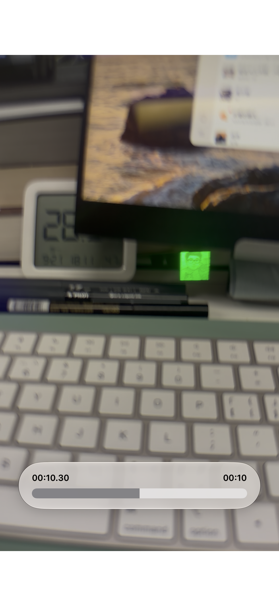

# 雷鸟 iO 固件实验：自定义代码、UI 与 PNG 显示

> **试验用品 / EXPERIMENTAL — 不是推荐刷入的日常固件。非开发者请勿尝试，不要随便刷。**
>
> 本目录验证的是：**能否通过官方 OTA 路径运行修改后的 AP、能否扩展眼镜 UI、能否显示普通 PNG 图片**。不是“为了做固件而做固件”，也不是提供一套成熟替代系统。可从代码和离线测试研究如何开发眼镜端应用，不需要先刷自己的眼镜。
>
> **刷错可能无法启动、失去蓝牙/OTA，甚至需要硬件恢复或返厂。** 掉电、意外中断、版本不匹配、错误代码和资源修改都有风险。**不得宣称官方回滚保证“几乎不会刷死”**：我们尚未验证故障回滚、掉电恢复或完整救砖。详见 [安全边界](docs/SAFETY.md)。

## 最新：TAP1-TEST-01 · Android 官方流程实刷

**2026-09-27：[完整插件 APK、TAP1 固件与教程](tap1/README.md)**。Fold3 / Android15 已获用户实刷成功确认；279片、AP全覆盖、零拦截。新增可见「显示TEST」标记，保留TAP1小应用运行时；AP为9,590,856字节，其他13个负载不变。公开APK不含网页正文适配或私人凭据，仍是高风险实验版本。

## 历史：FOCUS-04 四项菜单与原生番茄时钟

**2026-09-25 [FOCUS-04 / TFP1 源码、精确实刷固件及教程](native-navigation/focus/README.md)**：四项同屏菜单、左上角时间与电量、原生番茄计时，以及音乐/阅读/详情残留等交互修复；配套[新版 iOS 插件 UI 和打包入口](../../official-addon/focus-edition/README.md)。仅 AP 内容改变，大小 9,558,216 字节；其他 13 个负载不变。用户确认实刷正常，仍有无法启动或失去 OTA 的风险，不保证回滚或救砖。

## 历史：TWR1 / TNV1 与 TDP1

新增 [TWR1 微信读书：原创模块、精确实刷固件与离线重建](native-navigation/weread/README.md)，以及[研究思路](../../docs/WEREAD_RESEARCH.md)。不含网页正文适配、Cookie 或私用 IPA；公开手机模块未接入默认构建/专用打包门禁，没有匹配手机集成请先别刷。已知“长按旋钮返回可能异常”，不能把本页其他固件混用为阅读版。

2026-09-22 的新匹配版本已单独发布：[TNV1 固件与校验](https://github.com/Turbo1123/Turbo-IO/releases/tag/firmware-strix-1.0.4.12-tnv1) · [源码、构建与使用](native-navigation/README.md)。新增独立第九项导航，保留第八项 Turbo Display **测试工具**；手机传语义数据、眼镜本地绘制。仅 AP 内容变化，保留其余13项。本页下方继续记录早期 R3 图片验证，**不是 TNV1 操作指南，两个包不能混用**。

## R3 当时实际做到了什么

2026-09-21，在研究设备上，以 **Strix OS 1.0.4.12 + 官方 iOS 1.0.5（201）私用研究扩展**，经官方升级流程传输实验 R3。用户确认更新后显示预定图片，并能退出、再次进入图片页。

| 问题 | 本次结论 | 不能推导出的结论 |
| --- | --- | --- |
| 修改 AP 能否经 OTA 安装后运行？ | 这份固定哈希的 R3 得到用户实机确认 | 所有修改/版本都可刷；整个启动链没有签名检查 |
| 能否新增 UI 入口？ | 实验代码在原菜单末尾扩展 Turbo Photo 入口 | 任意替换整个系统 UI、成熟应用安装机制 |
| 能否显示普通图片？ | 88×98、RGBA8 PNG，4,022 字节，通过原生图片接口显示 | 蓝牙任意传图、任意 PNG/JPEG、视频或高刷新率都已实现 |
| 是否只改 application？ | 14 项负载中仅 `nuttx_ap.bin` 改变，另 13 项字节相同 | 完整 OTA 只会物理写 AP；恢复过程绝对安全 |
| 是否可以退出、重入？ | 用户实机确认可以 | 完整生命周期、长期稳定性和故障恢复均已验证 |

**已知现象：** 用户报告“第七个菜单只有文字，没有图标/动画，但可以进入”。新增 Turbo Photo 的最小实现确实只创建文字；是否指原第七项勿扰模式仍待确认，不能先认定不存在回归。详见 [验收矩阵](docs/VALIDATION.md)。

## 阅读顺序

**为什么只改 application？** 本次菜单、页面和 PNG 显示的目标代码都已定位在 `nuttx_ap.bin`，因此只改 AP，并更新清单对应的 Size/MD5；其余 13 项保持原样，尽量保留原厂通信、安装与恢复组件，减少变量、方便审查和定位问题。目的只是先验证眼镜应用/UI 扩展能力，不重写整套系统。AP 不是隔离的手机 App，改坏仍可能使系统无法启动或失去 OTA；**只改 AP 不等于只写 AP，更不保证不变砖**。详见[修改范围的取舍](docs/PROCESS.md)。

1. [风险、适用版本与停止条件](docs/SAFETY.md)
2. [完整研究过程：从静态分析到真机显示](docs/PROCESS.md)
3. [已验证、未验证与已知问题](docs/VALIDATION.md)
4. [离线校验、单元测试与构建](docs/BUILD.md)
5. [iOS OTA 适配参考与已知缺陷](ios-reference/README.md)

## 实验产物

**[R3 实验 Release：固件与哈希](https://github.com/Turbo1123/Turbo-IO/releases/tag/firmware-strix-1.0.4.12-turbophoto-r3)**（Pre-release，非稳定版）。

- 完整实验 OTA：`StrixOS-1.0.4.12-TurboPhoto-menu8-EXPERIMENTAL-UNFLASHED.zip`。保留首次刷写前的文件名及全部原始字节；`UNFLASHED` 是历史命名，实机验收状态以本文为准。
- 独立 AP：`nuttx_ap-TurboPhoto-R3-EXPERIMENTAL.bin`，用于静态分析/比较，**不是可单独交给 App 的升级包**。
- 原厂内容基线：`StrixOS-1.0.4.12-ORIGINAL-rollback.zip`。来自官方 App 缓存的原厂成员，本地重新打包；**不是原服务器 ZIP，也不是完整 Flash 备份，文件名不构成回退保证**。
- `SHA256SUMS`、`MD5SUMS`、`RELEASE_WARNING.md`。

修改包 SHA-256：`658352deed03c27102ad4151b104389d7f19a7690c505486d188261a483a32ff`。
AP SHA-256：`dbed42e8ef949ad5b0d327a2382c58a316ec31dff3b2dbbb90e442e695772268`。
AP MD5：`7704e86ebfdd3ff9a84c0f83060c21c3`（已替换原 AP 的旧 MD5）。

**本目录没有一键刷机命令。** 不提供个人签名 IPA、账号、服务 Key 或原始设备日志。手机模块已接入仓库的**可选实验构建**，普通构建仍不包含；开发者可用自己的兼容输入与签名构建，必须另做手机验收。它不是下载即可安装的成品。

## 图像与源码

下图为作者提供的**眼镜实际显示效果实拍**（视频画面截图），不是渲染图或模拟预览。镜片中显示的是本次 R3 内嵌的自定义头像。

另可查看作者提供的[彩色原图](assets/turbo-photo.png)，仅用于展示，不代表眼镜能够彩色显示。固件使用的 88×98 PNG 保存在 `assets/turbo-photo-firmware.png`，构建脚本仍引用这一精确素材。头像所有者已明确同意公开；**未修改固件内嵌图片或实测固件，Release 哈希不变**。

- `src/menu8-*.c/.h`：控制器、独立 UI 对象、原生 LVGL 绑定和目标 hook。
- `src/build-menu8-experiment.py`：严格绑定原厂 AP 哈希、保留原字段、生成新 AP 与清单的**离线**构建器。
- `src/preflight-menu8-ota.py`：整包/成员/清单/原厂差异检查，只读。
- `metadata/`：脱敏后的原厂文件哈希与本实验所需符号映射，不含个人设备信息。
- `ios-reference/`：本机下载源、逐片比对及人工授权保护；通过 `official-addon` 的独立实验选项编译/合并，**不是预签名 App**。

原创代码沿用仓库的 [PolyForm Noncommercial 1.0.0](../../LICENSE)。**这是源码可阅的非商业研究发布，不应称为允许任意商用的 OSI 开源许可。** 原厂固件/库/资源版权仍归雷鸟、恒玄及相关权利人，不因打包或提供补丁变成我们的原创源码，也不适用本仓库对原创代码的许可。参见 [第三方说明](../../THIRD_PARTY_NOTICES.md)。

## 后续方向

优先研究版本锁定的眼镜应用接口、独立页面生命周期、受限绘图与图片输入；之后再验证蓝牙文件接收 → 存储 → 显示链路。R3 的图片编入 AP，更换图片仍会产生新的待验证固件；后续 TDP1 已支持受限传图测试，详见上方新版本。**不要为了换一张图频繁刷机。**
