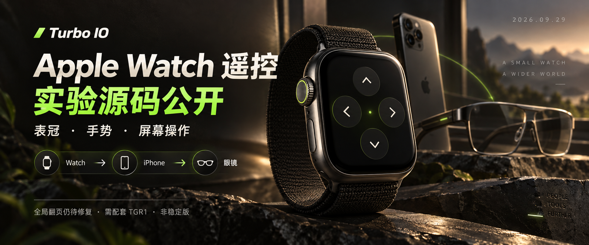

# Turbo IO · Apple Watch 遥控实验源码

2026-09-29 · WATCH-GLOBAL-01 / TGR1。Apple Watch 的表冠、屏幕按钮与手势，经配对 iPhone 中的雷鸟插件，转成眼镜输入。**不是手表直连眼镜，也不需要另装独立手机遥控器。**

**先看状态：私用 TGR1 已有用户反馈刷入完成，但随后反馈“翻页翻不了”，尚未定位闭环。公开抽取版只完成下述离线测试与构建，没有安装或真机输入验收。请勿把源码公开理解为全局遥控已经可用。**



*imagegen 概念图，不是实机截图。*

本次公开 Watch UI/输入核心、iOS 插件桥与设置页、TGR1 AP 协议/输入适配、公开源码派生脚本及测试；另附[原样 TGR1 实验 OTA 与校验说明](FIRMWARE_RELEASE.md)。不发布合并 IPA、签名 Watch App、描述文件、证书、设备标识、Cookie、Key或个人诊断。原创代码沿用 [PolyForm Noncommercial 1.0.0](../LICENSE)；第三方、厂商及 Apple 内容保留各自权利，完整 OTA 不等于原厂固件源码开源。

## 功能与边界

| 输入/选项 | 实现与边界 |
| --- | --- |
| Digital Crown 旋转 | 上一项/下一项，支持反向；不劫持表冠实体按压 |
| 屏幕 | 上一项、下一项、确认、返回四个按钮 |
| 默认手势 | 双指互点两下 → 下一项；左右转腕并回正 → 确认 |
| 另一套映射 | 双指确认；转腕上一项/下一项；保存用户选择 |
| 手机授权 | 10 分钟或始终开启；始终开启不等于系统保证后台可达 |
| 全局模式 | 需要 TGR1 AP 输入适配；当前翻页问题仍待修复 |
| 旧应用语义模式 | 音乐切换/暂停与已有番茄暂停/停止；需要相应手机功能和眼镜运行时，不是原厂任意页面全局控制 |
| 仅本机识别/观察模式 | 不向眼镜执行按键；先检查手势和 WatchConnectivity |

手势受系统支持能力和前台状态约束，未验证型号不承诺支持双指互点。进入 Watch 设置、离开遥控页或失去 active 状态会停止采样；回来后需重新开启。手机被系统挂起、断线或 Watch 黑屏时不保证可达，不使用伪造运动/音频保活。

链路：`Watch → WatchConnectivity → iOS 插件 → 业务 15 → AP UI 线程 → 原厂输入分发`。

断线、超时、忙碌、重复和过期按键直接丢弃，不排队、不补发。“不重试旧按键”是防止连接恢复后突然翻页，不是要求反复点击。息屏后的首次输入只唤醒；已分发回执不能证明镜片完成操作。OTA 活动或状态未知时拒绝遥控，不能为遥控强制解除未完成的升级保护。

## 1. 离线测试与 Watch 构建

需要 macOS、Xcode iOS/watchOS SDK、Python 3、XcodeGen。工程最低声明 iOS 18 / watchOS 11；不代表这些系统/型号均已实测。

```sh
bash watch-remote/tests/run.sh
PYTHONDONTWRITEBYTECODE=1 python3 -m unittest discover -s watch-remote/tests -p 'test_*.py' -v
cd watch-remote
xcodegen generate --spec project.yml
xcodebuild -project TurboWatchRemote.xcodeproj -scheme RayNeoWatchRemote \
  -configuration Release -destination 'generic/platform=watchOS' \
  -derivedDataPath build-public-watch CODE_SIGNING_ALLOWED=NO build
```

交付目标是 `RayNeoWatchRemote`，宿主为 `com.rayneo.venus.pub`。`TurboWatchProbe` / `TurboWatchRemote` 是独立 R0 观察测试器，不是雷鸟插件交付目标。无签名产物不能安装到手表。

## 2. 接入公开 iOS 插件

从仓库根运行，创建新目录，不修改原 `focus-edition`：

```sh
python3 watch-remote/stage-addon.py \
  --base official-addon/focus-edition --out watch-remote/build-public-phone
cd watch-remote/build-public-phone
TIO_IMAGE_RX_LAB=1 TIO_DISPLAY_PHONE=1 bash build.sh embedded
```

这个公开派生只接入 Watch，不启用 OTA 编译开关、不包含服务配置，也不是私用手机包的完整复制。脚本核对精确插入点，不匹配会停止；失败输出不可用于打包，检查原因后换一个新目录。不得用 `python -O` 跳过断言，不要覆盖其他派生树。

- 编译 `Addon/*.m`、`Firmware/remote.c`，链接 WatchConnectivity。
- `DisplayPhoneUI.m` 回执分类和消费接入 TGR1，不吞掉其他业务回执。
- 设置页增加 Watch 遥控；音乐仅追加当前会话可用性查询。
- 宿主已有其他 `WCSessionDelegate` 时拒绝抢占。与提词卡/跑步等其他 Watch 伴侣必须统一消息分发，不能叠加两个接收器。

按 [官方扩展构建说明](../official-addon/README.md)准备合法兼容宿主，用新生成的 `build/image-rx-lab/TurboIOPrivateAddon.dylib` 打包。常规 `official-addon/package.mjs` 不会自动嵌入本 Watch；下一步单独创建伴侣派生。

## 3. 签名、嵌入与安装

在 Xcode 中用自己的团队给 `RayNeoWatchRemote` 签名。手机/Watch 须同团队；Watch Bundle ID 为手机 ID 加 `.turbowatch`，伴侣标识指向手机 ID，版本与 build number 完全一致。开发描述文件必须包含**实际 Watch UDID**，不能只登记手机。工程默认不写个人 Team。

已有签名插件宿主和签名 Watch 后：

```sh
python3 watch-remote/embed-companion.py \
  --host /absolute/your-signed-host/Payload/Runner.app \
  --watch /absolute/your-signed-watch/RayNeoWatchRemote.app \
  --identity YOUR_CERTIFICATE_SHA1 --watch-udid YOUR_WATCH_UDID \
  --out /absolute/new-private-output
```

工具检查团队、版本、描述文件期限、Watch 授权、Mach-O 签名及插件导出，拒绝覆盖已有伴侣，复制到新目录后重签宿主。**不安装、不刷机；新通用封装工具本轮仅完成合成元数据测试，尚未真实签名及安装验收。** 输出 IPA、entitlements、所有签名输入只留本机，不提交仓库。

安装手机派生后，在 iPhone 的 Watch App 中安装 Turbo 遥控。开发模式/信任按系统提示完成。“无法验证完整性”应检查 Watch 是否在有效描述文件中、嵌套可执行文件是否同团队正确签名；手机安装成功不代表 Watch 签名正确。

## 4. AP 接入，不是刷机教程

`Firmware/remote.c` 是固定长度 TGR1 编解码/租期门禁，`remote_native.c` 是固定 Strix 1.0.4.12 ABI 的输入适配。**其他版本不能复用地址。**

在公开 TAP1 源码快照上生成离线派生：

```sh
python3 watch-remote/stage-firmware.py \
  --base firmware-research/strix-1.0.4.12/tap1/source \
  --out watch-remote/build-public-firmware
```

该步骤仅复制原创源码、增加编译单元并扩展既有消息 hook，不生成可刷 ZIP。完整链接还依赖原厂基线、符号和构建输入，见 [TAP1 源码边界](../firmware-research/strix-1.0.4.12/tap1/README.md)。公开 TAP1、FOCUS-04 和原厂固件不能假定已支持 TGR1；不要把其他 Release 的固件当作配套包。

后续候选必须重新核对：仅 `nuttx_ap.bin` 改变，其他 13 个负载逐字节一致，AP 长度、MD5、OTA 清单及 ZIP SHA-256 一致，并检查 AP 分区预算。仅改 AP 仍可能崩溃、失去升级能力或损坏设备，回滚不保证救砖。**当前输入问题未闭环；另附的原样归档包仅供开发研究，不应盲刷。** 公开源码派生脚本不会自动开启 TGR1 OTA，旧版公开 APK 也不能直接刷这个包；详见[发布与兼容条件](FIRMWARE_RELEASE.md)。

协议、内存所有权、时限和逐页验收见 [GLOBAL_REMOTE.md](GLOBAL_REMOTE.md)。`tests/global_arm.py` 供具备完整候选 BIN/ELF 时运行 ARM 模型测试，需要 Unicorn、llvm-nm；不是真机证明，本次抽取没有重新链接候选。

## 本次验收 · 2026-09-29

- Swift 核心 47 项、手机门禁 19 项、真实手机桥 + 模拟传输 28 项通过。
- C 协议 ASan/UBSan 通过；无蓝牙操作。
- 伴侣封装的 3 组元数据单测通过，覆盖版本、团队、证书、过期和实际手表登记不匹配。
- Watch Release 无签名构建、公开 focus-edition + Watch 插件 arm64 dylib 构建通过。
- 手机模拟器 QA 宿主编译通过；本轮未运行 QA App，不把历史 39 项模拟器结果记为本轮通过。
- 公开 phone/AP 源码派生成功，没有生成、安装或刷写新的眼镜固件。
- 真人手势、表冠方向、逐页返回、后台及断连恢复未验收。优先解决已有“翻页翻不了”反馈，再讨论稳定性。

反馈可提供系统/固件版本、页面、动作、脱敏状态码；不要上传账号、Cookie、设备身份、健康数据或签名材料。
